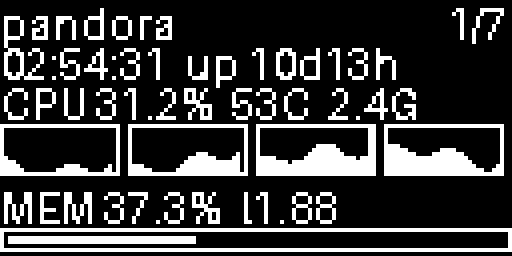
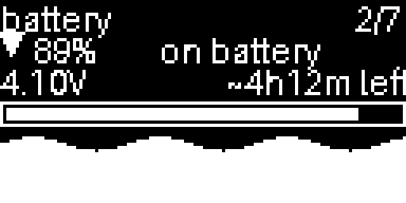
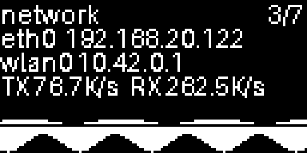
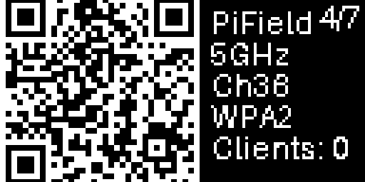
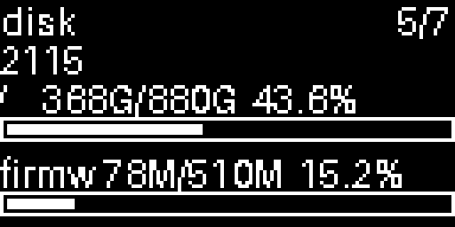
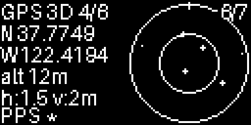
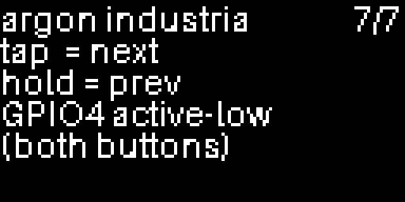

# argon-forty-display

A Python status-display application for the **Argon Forty Industria OLED module** on Raspberry Pi 5, *and* reverse-engineered notes on the module's otherwise-undocumented hardware interface.

The Industria OLED ships as part of the Argon V5 case bundle and connects to the Argon PoE+ / M.2 NVMe HAT via a proprietary 5-pin JST-SH connector. As of this writing, Argon Forty publishes essentially **no** documentation on the connector pinout or the button protocol — their official product page returns 404. Existing community projects work around the gap empirically; this repo names the constraint they're conforming to.

---

## Hardware reference

Empirically verified on a Raspberry Pi 5 running Debian 13 (Trixie) with `libgpiod` 2.2.x. Anyone with the same module can reproduce these findings using `scripts/probe_buttons.py`.

### OLED panel

| Property | Value |
|---|---|
| Controller | SSD1306 (compatible with `luma.oled`) |
| Resolution | 128 × 64, 1-bit |
| Bus | `/dev/i2c-1` |
| I2C address | `0x3C` |
| Initialization | Standard SSD1306 init; no proprietary handshake |

### Buttons — *the part nobody documents*

The Industria has **two physical buttons** (microswitches actuated by pressing the case housing — not capacitive touch on the screen face, despite some product copy suggesting otherwise). They are:

- Both wired **in parallel onto a single signal line: BCM GPIO 4** (`/dev/gpiochip0`, line 4).
- **Electrically indistinguishable.** There is no way to tell which of the two buttons was pressed; the connector geometry simply does not have room for a second signal line.
- Active-low. Internal `PULL_UP` bias is sufficient — no external pull-up needed.
- Bounce can be severe on at least one of the two buttons (mechanical force on the housing produces inconsistent contact). A software debounce window of ~50 ms is comfortable.

This is the constraint that explains why every existing Argon OLED community add-on uses *press patterns* (short / long / double / hold-N-seconds) rather than per-button actions: with one wire for two buttons, press patterns are the only encoding available.

### Connector

The OLED module connects to the HAT via a 5-pin JST-SH socket. Empirically the connector carries:

- `3.3 V` (presumed; not metered)
- `GND`
- `SDA` (BCM 2 / I2C-1 data)
- `SCL` (BCM 3 / I2C-1 clock)
- Button signal (BCM 4)

The exact pin order on the connector body has not been confirmed by probing each contact individually; only the *set of signals* is verified.

### Pi 5 + Trixie GPIO chip note

On current Raspberry Pi 5 Trixie kernels (`6.12.x`, `libgpiod 2.2.x`), the 40-pin header is exposed on **`/dev/gpiochip0`**, not `/dev/gpiochip4`. Older Pi 5 documentation that names `gpiochip4` was correct under earlier kernels and is no longer accurate. Always verify with `gpioinfo` before targeting a chip number.

### What is *not* on the I2C bus

Polling I2C address `0x3C` (the SSD1306) for register reads while pressing buttons yields zero changes. The buttons are pure GPIO; do not look for them on I2C. No other I2C addresses appear when the module is connected.

### X1207 UPS HAT

The Argon Industria stack sits above a Geekworm X1207 UPS / PoE module on this Pi. Geekworm publishes sparse documentation on the X1207's signaling, and existing community scripts make assumptions that don't match what the hardware actually does. The following was determined empirically with `scripts/probe_x1207.py` by cycling PoE and USB-C inputs across two repetitions while watching every claimable GPIO line on `gpiochip0` and the fuel gauge over I²C-1.

**Fuel gauge — I²C-1 @ `0x36`.** A MAX17040-family chip. The `VERSION` register at `0x08` returns `0x0002` on this unit, confirming the older MAX17040/41 silicon (not the MAX17048, which would carry a `CRATE` charge-rate register at `0x16`). The practical consequence: **charge vs. discharge cannot be read directly from a register** — direction must be derived from a SOC time-series, from GPIO6 (see below), or both. Standard MAX17040 register layout applies: `VCELL` at `0x02` (× 78.125 µV/LSB), `SOC` at `0x04` (upper byte = whole percent, lower byte = fractional /256), `MODE` at `0x06`, `CONFIG` at `0x0C`. The chip transmits MSB first; SMBus reads come back little-endian, so each word must be byte-swapped before interpretation.

**GPIO6 — power-source change indicator (approximate).** With internal pull-up bias and BOTH-edge detection, GPIO6 fires edges around USB-C / PoE plug and unplug events, but it is **not a clean state line**:

- **Bouncy.** Each plug or unplug typically produces 1-4 edges over ~5-10 seconds. Software debounce of ≥500 ms is required to extract a stable level.
- **Can latch silent.** After three rapid input transitions in succession, the X1207's state machine on this board stopped emitting GPIO6 events entirely. Five subsequent power transitions across the same input pins produced zero edges, while the same transitions before the latch had produced 10 edges. Recovery appears to require a reboot of the UPS. Treat GPIO6 as a *hint* layered on top of the more reliable SOC trend, not as ground truth.

**GPIO16 — *not* a useful status line on this unit.** Existing community scripts (and prior-art Geekworm-adjacent code) interpret GPIO16 as a charge-enable indicator. With pull-up bias applied during the probe, GPIO16 read constant low through *every* input transition across both probe rounds — meaning it is externally pinned, not driven dynamically. Reading it does not yield meaningful charging-state information regardless of vendor docs. Don't depend on it.

**No other header lines are wired.** All 19 other unclaimed BCM lines on `gpiochip0` (`5, 7-13, 17, 19-27`) showed zero edges across all test phases. Only GPIO6 carries any X1207 power-event signal; everything else is electrically idle.

---

## Application

A multi-screen system status display that uses the Industria OLED for headless Pi monitoring. Seven screens, navigated with the buttons (any button → tap = next, hold = previous):

| # | Screen | Preview | Shows |
|---|---|---|---|
| 1 | **status**  |    | hostname, time/uptime, CPU summary (% / temp / freq), per-core scrolling sparklines, MEM bar with load average |
| 2 | **battery** |  | Live X1207 UPS state: SOC % with direction glyph (charging / discharging / idle / full), source-hint label (external / on battery / unknown), voltage, ETA to empty or to full, full-width SOC bar, ~21-minute SOC sparkline. Graceful no-UPS and stale modes |
| 3 | **network** |  | IPv4 address per interface, current TX/RX rates, dual-channel sparkline (TX above midline, RX below) |
| 4 | **wifi**    |        | Wi-Fi join QR code (decoded from the active NetworkManager AP-mode connection), SSID / band / channel / auth / connected-client count |
| 5 | **disk**    |        | Primary block-device model name (read from `/sys/block/<dev>/device/model`), per-mount usage with progress bars |
| 6 | **gps**     |          | Lock status (`no` / `2D` / `3D`), satellites used / visible, lat/lon/alt, horizontal/vertical accuracy, PPS pulse indicator, polar sky map of visible satellites — graceful "no gpsd" / "no fix" handling when the receiver isn't ready |
| 7 | **help**    |        | Button cheat-sheet |

The previews are generated by `scripts/render_screens.py` from the live module code; regenerate them after any layout change so the README and the actual OLED stay in sync.

The wifi screen auto-discovers the active AP-mode connection from NetworkManager and reads the PSK without requiring root, on default polkit policies.

The GPS screen connects to a local `gpsd` (port 2947) over its JSON socket — no extra Python deps. Works with any gpsd-supported receiver; tested with the Waveshare LC29H multi-GNSS module via USB-UART (CP2102N).

The battery screen reads the MAX17040 fuel gauge over I²C-1 every 5 s and watches GPIO6 (debounced, 750 ms) for power-source change events. Direction comes from a 60 s rolling SOC slope (the MAX17040 silicon doesn't carry a `CRATE` register); the GPIO6 signal only feeds the source-hint label, never the direction, so the documented X1207 latch behavior cannot corrupt the displayed state. See the [Hardware reference § X1207 UPS HAT](#x1207-ups-hat) for the empirical signaling notes.

---

## Requirements

- Raspberry Pi 5 (other Pis likely work but untested)
- Debian 13 (Trixie) or compatible
- `libgpiod` v2 (`python3-libgpiod 2.x`)
- I2C-1 enabled (`raspi-config`)
- The current user in `i2c` and `gpio` groups
- `uv` (or any other PEP 517 / 621 runner)

For the optional features:
- **GPS screen**: `gpsd` with a configured device (e.g. `sudo gpsdctl add /dev/ttyUSB0`)
- **Wifi QR screen**: NetworkManager with an AP-mode connection on the wireless interface
- **Battery screen**: a Geekworm X1207 UPS / PoE HAT — or any compatible MAX17040-based UPS at I²C `0x36`. With `--no-battery` the screen and watcher are omitted entirely so a Pi without the HAT runs the original 6-screen carousel.

---

## Install

```bash
git clone https://github.com/cameronzucker/argon-forty-display.git
cd argon-forty-display
uv venv --system-site-packages
uv sync
```

The `--system-site-packages` flag matters: it lets the venv use the Debian-packaged `python3-libgpiod` (built against the system `libgpiod3` C library) instead of pulling a separate `gpiod` from PyPI. On ARM that's the path of least friction.

## Run

```bash
uv run python -m argon_oled
```

Useful flags:

| Flag | Default | Purpose |
|---|---|---|
| `--i2c-port` | `1` | I2C bus number |
| `--i2c-address` | `0x3C` | OLED I2C address |
| `--gpiochip` | `/dev/gpiochip0` | GPIO chip path |
| `--button-line` | `4` | BCM GPIO line for the button signal |
| `--long-press-ms` | `700` | Threshold for short vs long press |
| `--debounce-ms` | `50` | Software debounce window |
| `--no-buttons` | off | Disable the button watcher (e.g. for testing in a contested env) |
| `--hotspot-connection` | autodetect | Override the NM connection name for the wifi screen |
| `--frame-ms` | `100` | Render frame period |
| `--log-level` | `INFO` | Python logging level |
| `--no-battery` | off | Disable the X1207 battery watcher and omit the battery screen |
| `--battery-i2c-bus` | `1` | I²C bus number for the X1207 fuel gauge |
| `--battery-i2c-address` | `0x36` | MAX17040 I²C address (accepts `0x36` or `54`) |
| `--battery-gpio-line` | `6` | BCM line for the X1207 power-source signal |
| `--battery-debounce-ms` | `750` | Software debounce window for GPIO6 edges (sized to the bouncy hardware) |
| `--battery-sample-ms` | `5000` | I²C polling cadence for SOC and voltage |

## Run at boot (systemd)

Once you've confirmed the app works in the foreground, install it as a system service so it starts automatically on every boot:

```bash
sudo install -m 644 systemd/argon-oled.service /etc/systemd/system/
sudo sed -i "s|<USER>|$USER|g; s|<HOME>|$HOME|g" /etc/systemd/system/argon-oled.service
sudo systemctl daemon-reload
sudo systemctl enable --now argon-oled
```

The unit runs as your normal login user (no root) — the user just needs to be in `i2c` and `gpio` (which is the case if the foreground command worked). Logs go to the journal:

```bash
journalctl -u argon-oled -f
```

To stop or remove later:

```bash
sudo systemctl disable --now argon-oled
sudo rm /etc/systemd/system/argon-oled.service
sudo systemctl daemon-reload
```

## Diagnostic scripts

- `scripts/hello.py` — minimum SSD1306 smoke test. Draws a four-line test pattern. Use this first if the display isn't responding.
- `scripts/probe_buttons.py` — the tool used to reverse-engineer the button protocol. Watches every unclaimed GPIO header line on `gpiochip0` for edge events with `PULL_UP` bias and concurrently polls I2C `0x3C` for changing reads. Press buttons in known sequences and read the per-line summary on Ctrl-C.
- `scripts/probe_x1207.py` — the tool used to reverse-engineer the X1207 UPS HAT's signaling. Runs an autonomous 8-step PoE/USB-C cycling sequence while watching every claimable GPIO line and polling the MAX17040 fuel gauge. Detaches cleanly so the operator can yank power without killing the probe. Output goes to `/tmp/x1207_probe_<timestamp>.log` with a per-phase summary at the end.
- `scripts/render_screens.py` — regenerates the per-screen previews under `docs/screenshots/`. Renders each carousel screen to a 4×-scaled PNG, using live system data where it works without GPIO contention (status, network, wifi, disk) and fixture data where the running service or absent peripherals would otherwise produce an unrepresentative image (battery, gps). Run after any layout change to keep the README and the OLED in sync.

---

## Architecture

```
argon_oled/
├── app.py        # render loop, button-event drain, CLI
├── battery.py    # MAX17040 fuel-gauge sampler + GPIO6 watcher (X1207 UPS)
├── buttons.py    # debounced GPIO watcher → ButtonEvent (SHORT / LONG)
├── metrics.py    # SystemSnapshot dataclass (psutil, /proc, /sys)
├── hotspot.py    # nmcli wrapper, Wi-Fi QR payload builder
├── gps.py        # background gpsd JSON-socket client
├── screens.py    # Screen protocol + StatusScreen, BatteryScreen,
│                 # NetworkScreen, HotspotScreen, DiskScreen, GPSScreen,
│                 # HelpScreen, ScreenCarousel
├── __main__.py   # `python -m argon_oled` entry point
└── __init__.py
```

Each screen renders into its own Pillow `Image` per frame; the carousel composites the active screen and adds a top-right index hint. Metrics and rendering run at separate cadences so animations (sparklines, PPS blink) don't gate on slow data sources. The battery screen reads from a `BatteryWatcher` background thread that owns the I²C session and a libgpiod-claimed GPIO6, publishing a frozen `BatteryStatus` snapshot atomically — readers fetch `watcher.status` without locking, the same way `GPSScreen` consumes its `GPSDClient`.

---

## Acknowledgments / prior art

These projects independently arrived at "BCM GPIO 4 + press patterns" without naming the underlying parallel-wiring constraint. They were the starting point that confirmed we were on the right pin:

- [BenWolstencroft/home-assistant-addons — argon-oled-addon](https://github.com/BenWolstencroft/home-assistant-addons/tree/main/argon-oled-addon)
- [g8keeper22/Pi-Hole-Data-on-Argon-ONE-V5-OLED-Display](https://github.com/g8keeper22/Pi-Hole-Data-on-Argon-ONE-V5-OLED-Display)
- [forum-raspberrypi.de thread #64770](https://forum-raspberrypi.de/forum/thread/64770-argon-one-v5-oled-display/) — useful for the libgpiod v1 → v2 transition on Trixie

If you're building software for this module and you find evidence that something in the *Hardware reference* section is wrong on your specific board revision, please open an issue.

## License

MIT — see [LICENSE](LICENSE).
